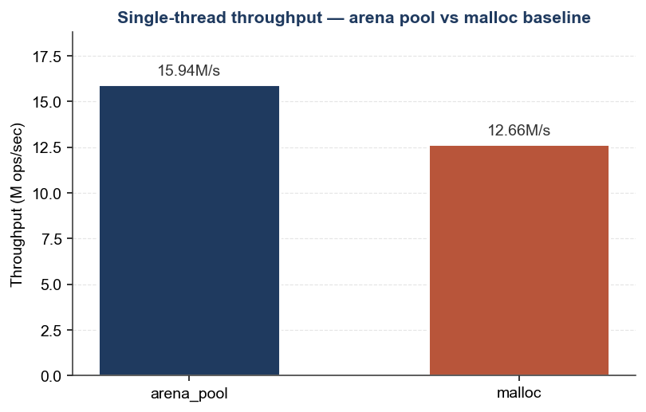
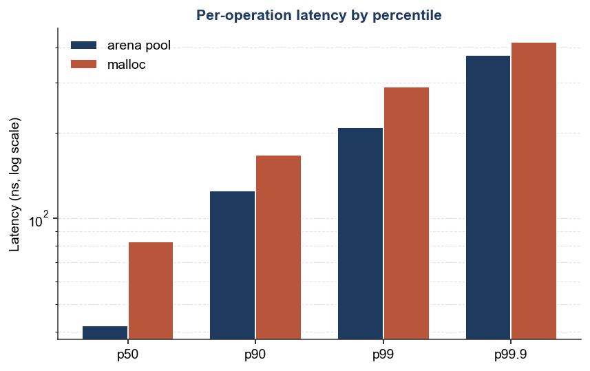
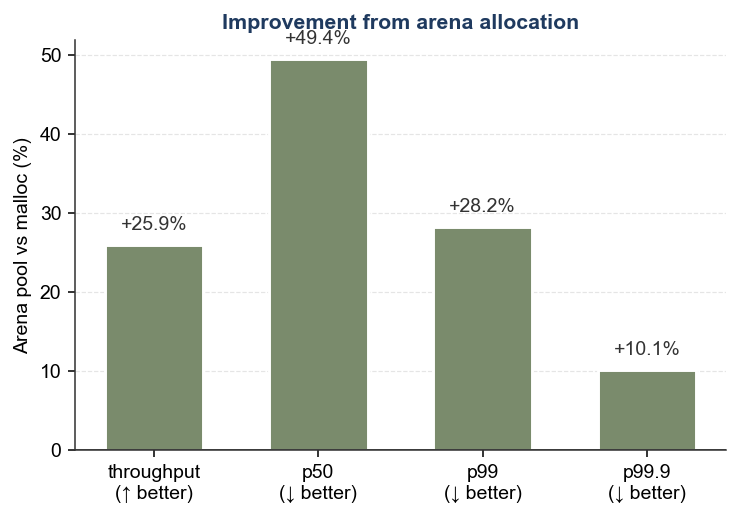

# Limit Order Book Matching Engine

A single-threaded, price-time-priority limit order book and matching engine
in C++23. Supports limit, market, and cancel orders with O(log P) best-price
access and O(1) cancel-by-id.

## Highlights

- **Intrusive doubly-linked lists per price level**, indexed by a sorted
  `std::map`. Bids descending, asks ascending — `begin()` is always the
  touch price.
- **Arena-allocated order pool** — no `malloc` / `free` on the hot path and
  no atomic reference-count overhead from `shared_ptr`.
- **CRTP publisher template** with a zero-cost `NullPublisher` default —
  market-data callbacks resolve at compile time and compile away entirely
  for benchmarks.
- **30+ unit tests** covering crossed-book, partial-fill, self-trade,
  iterator-invalidation, and randomized invariant scenarios.

## Results

Median of 5 runs per configuration, 2M operations each.

### Throughput


### Latency percentiles


### Arena vs malloc baseline


Raw cache-miss measurements (`perf stat -e L1-dcache-load-misses`):

| Build          | L1-dcache-load-misses | Δ vs malloc |
| -------------- | --------------------: | ----------: |
| `bench`        | _fill in_             | _fill in_   |
| `bench_nopool` | _fill in_             | baseline    |

## Build

Requires a C++23 compiler (gcc 12+, clang 16+).

```bash
make test            # runs the unit test suite
make bench           # builds the arena-allocated benchmark
make bench_nopool    # builds the malloc-baseline benchmark for comparison
```

## Measure

```bash
python3 -m venv .venv && source .venv/bin/activate
pip install matplotlib numpy

python3 scripts/run_bench.py        # runs both binaries 5x, captures median
python3 scripts/plot_results.py     # regenerates docs/figures/*.png
```

For raw cache stats on Linux:

```bash
sudo perf stat -e L1-dcache-loads,L1-dcache-load-misses ./build/bench 2000000
sudo perf stat -e L1-dcache-loads,L1-dcache-load-misses ./build/bench_nopool 2000000
```

## Design

Per-level FIFO is an intrusive doubly-linked list owned by a `Limit` class
that caches aggregate volume and order count. Limits are stored by value
inside a `std::map<Price, Limit>` keyed by price — bids descending, asks
ascending — so `begin()` is always the touch price. A
`std::unordered_map<OrderId, Order*>` gives O(1) cancel by id.

The full design discussion, including the design choices adopted from
[`jxm35/LimitOrderBook-MatchingEngine`](https://github.com/jxm35/LimitOrderBook-MatchingEngine)
(which I studied as a reference) and the choices I made differently, is in
[DESIGN_NOTES.md](DESIGN_NOTES.md).

## Project layout

```
include/lob/      public headers — header-only library
tests/            unit test driver
bench/            throughput + latency benchmark
scripts/          measurement and plotting helpers
docs/figures/     generated graphs
results/          benchmark output (json)
```

## License

MIT.
